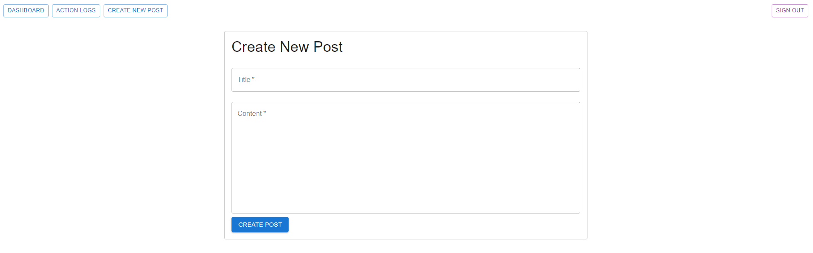
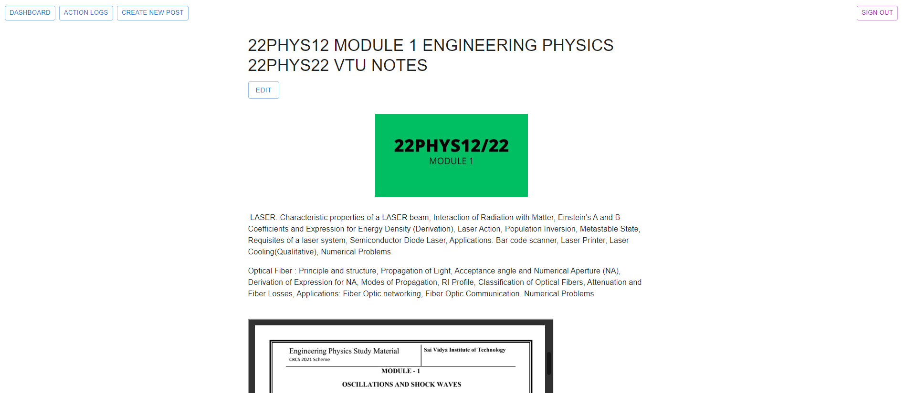
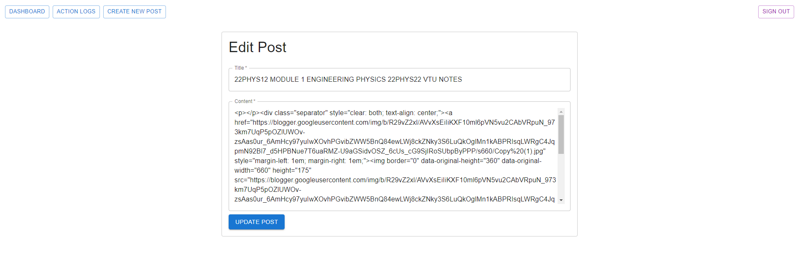
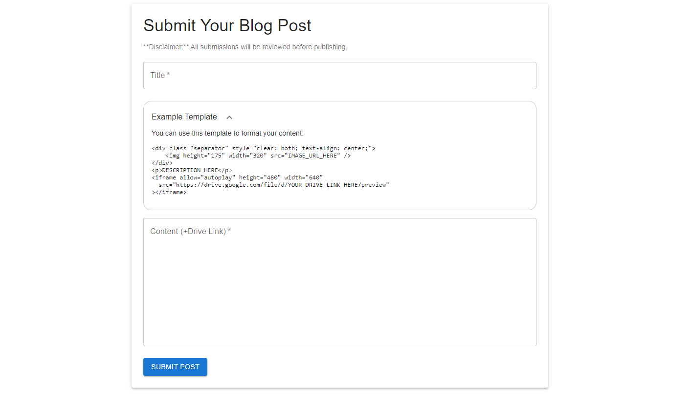

# VtuGuide Blogger Website Control App
• A fully functional website application to manage operations for Blogger websites, including my educational website, [vtuguide.in](https://vtuguide.in), which has received over 500k+ views and 80k+ clicks from Google search.

• Implemented features for creating, reading, updating, and deleting blog posts, along with an integrated analytics dashboard using the Google Analytics API to track and display website performance metrics.

• Includes a feature that allows users to contribute posts, which can be reviewed and published on the website. 

## Available Features (Note: Beta Version)

### Dashboard Page

### CRUD Pages

### UserActions Log Page

### Public Post Contribution Page

