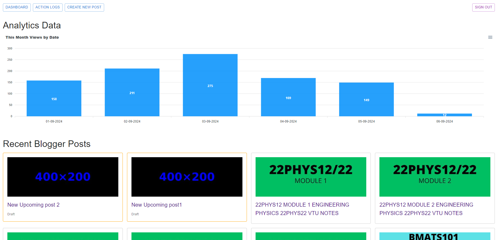
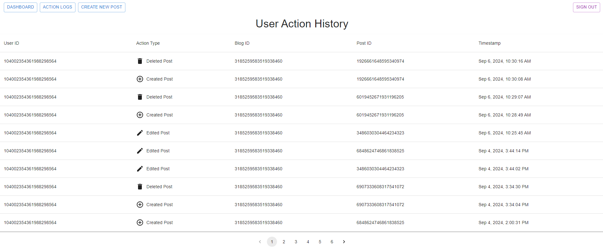

# VtuGuide Blogger Website Control App
• Developed a website application to manage operations for Blogger websites, including my educational website, VtuGuide.in, which has received over 500k+ views and 80k+ clicks from Google search.

• Implemented features for creating, reading, updating, and deleting blog posts, along with an integrated analytics dashboard using the Google Analytics API to track and display website performance metrics.

## Available Features (Note: Beta Version)

### Dashboard Page

### UserActions Page

### CRUD Pages
